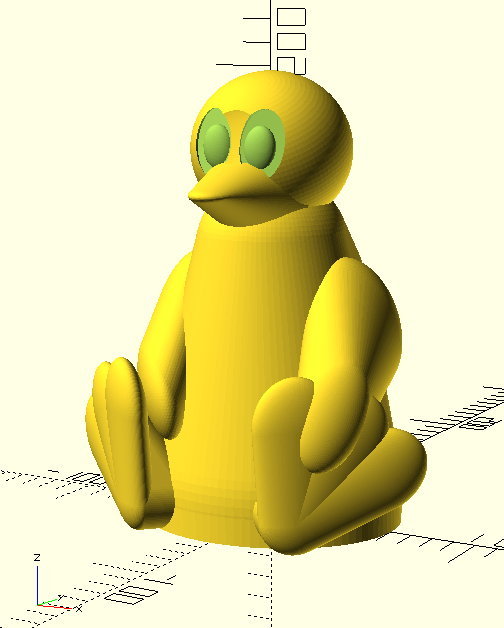
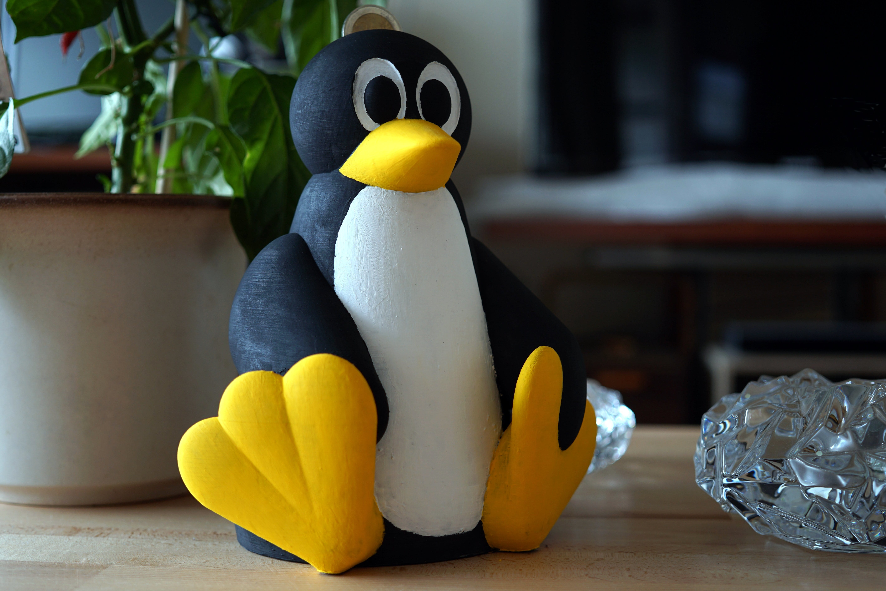

# Tux money box for 3D printing

 
This is a 3d model of the Linux mascot Tux. It is designed as a moneybox, but can also rendered as a simple figure. The size can be adjusted. This model is written with OpenSCAD and is based on the [runeman](runeman.org/3d/tux) model.

 

 

## Parameters

With the following parameter ``renderer`` you can choos which object you want render.

 
| renderer   | Options         | Description                                                                                 |
| -----    | ------          | -----------                                                                                 |
| Tux      | hight           | Print the Tux as a figure with the given hight                                                     |
| moneybox | hight, currency | Print the Tux as a moneybox for given currency. Actually supportet (Euro, Sterling, Dollar) |
| lock     | hight           | This is vor printing the moneybox lock.                                                     |

## ToDo

- Redesign the Head of the Tux
- Improve the lock

# Tux Spardose für den 3D Drucker
Dieses 3D Tux Modell ist mit Openscad erstellt und modular aufgebaut. Der Tux lässt sich in seiner Größe variieren und kann als Figur oder Spardose gerendert werden. Als Vorlage für dieses Modell diente das Modell von [runeman](runeman.org/3d/tux).

## Parameter

You can print difference modells of the Tux. 

| Modell   | Options         | Description                                                                                 |
| -----    | ------          | -----------                                                                                 |
| Tux      | hight           | Der Tux als Figur in gegebener Höhe.                                              |
| moneybox | hight, currency | Render den Tux in gegebener Größe. Aktuell können die Währungen Euro, Sterling und Dollar gewählt werden. |
| lock     | hight           |  Der Verschluss der Spardose.                                |

## ToDo

- Kopfform anpassen
- Verschluss verbessern

